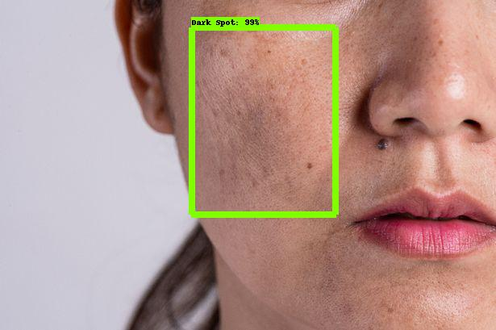
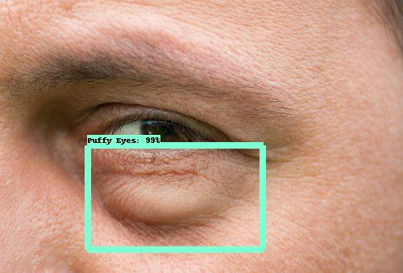

# Ageing-Sign-Detection

## Introduction
Facial wrinkles, dark spots and puffy eyes are often considered to be significant ageing signs. However they can occur at a pretty early stage as well and therefore it is important for them to be detected at an early stage and have an appointment with your dermatologist/cosmetologist.

## Model Architecture

This is a deep learning solution to the problem, where a neural architecture learns to identify these signs with an image of your face. The model predicts several bounding boxes over the image that is provided and reports back it's findings and their confidence scores of these ageing signs.

It heavily relies on the Tensorflow Object Detection API, which can be used for object localization on a custom dataset. The architecture used a pre-trained EFficientDet model which was then again trained for about 2 hours on the custom data and it gave pretty interesting results.

## Results

## Further Improvements

* The idea is to convert this solution into a light weight model, which can then be run on mobile phones for feature detection/localization through the front camera of the device.

## Resources

* [TensorFlow Tutorials-Object_Detection](https://www.tensorflow.org/hub/tutorials/object_detection)

* [Tensorflow Object Detection with Tensorflow 2: Creating a Custom Model](https://www.youtube.com/watch?v=cvyDYdI2nEI)    

